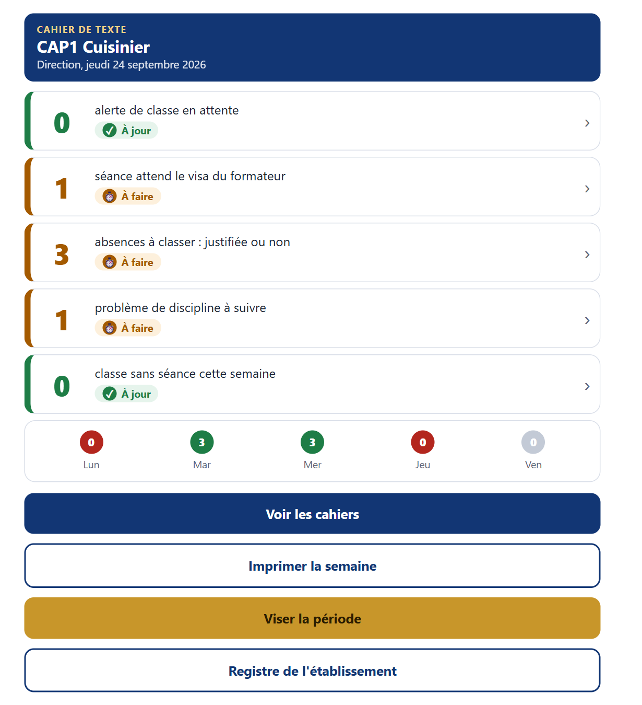
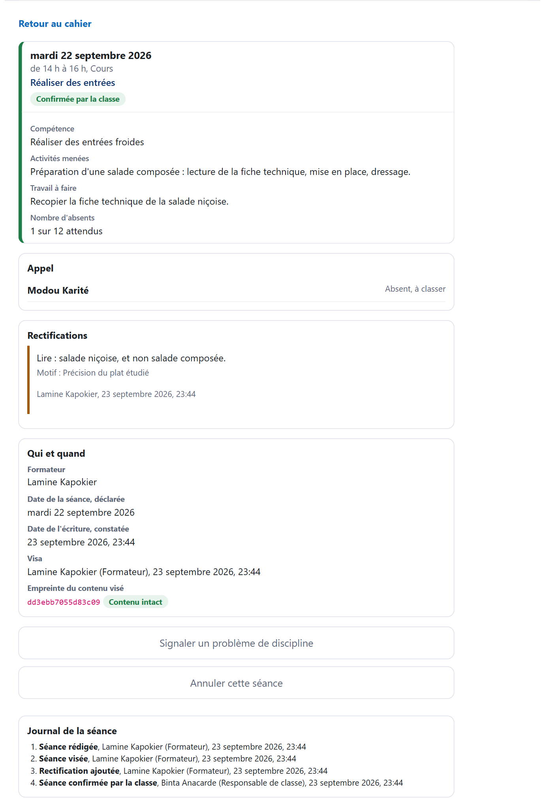

# Le cahier de texte électronique d'e-jàng

Extension conçue pour **e-jàng**, la plateforme nationale de formation à distance de la formation professionnelle et technique du Sénégal. Elle donne à chaque classe un **cahier de texte électronique** : le document contractuel où le formateur inscrit ce qu'il a fait, où la classe confirme, où la surveillance tient l'appel et où la direction et l'inspection visent.

Le cahier de texte n'est pas un support de cours. C'est une pièce de preuve. Le numériser ne vaut que s'il reste **daté**, **visé** et **contrôlable**. C'est toute la difficulté et le cœur de cette extension.

Conçue au sein de la **Direction des Curricula et des Innovations Pédagogiques (DCIP)**.

> 🟢 **Installé sur e-jàng** depuis septembre 2026. Pilote en préparation dans trois établissements.

---

## En images

Le tableau de bord de la direction : cinq tuiles, trois couleurs, un seul geste par tuile. Il se lit en cinq secondes.

Une séance visée par le formateur puis confirmée par la classe. L'erreur est corrigée par une rectification signée et datée : l'original reste lisible, l'empreinte atteste que le contenu visé n'a pas bougé.

*Captures produites sur un banc de démonstration alimenté par des données fictives : l'établissement, les personnes et les séances y sont inventés. Toute ressemblance de nom avec une personne réelle serait fortuite.*

---

## Ce qui le caractérise

- **✍️ Utile au formateur avant d'être utile au contrôle** : la séance précédente est rappelée, les objectifs spécifiques sont proposés depuis le cours, l'appel se fait par exception (« tous présents sauf »).
- **🔏 Rien ne s'efface** : une séance visée ne se modifie plus. Elle se rectifie ou s'annule : tout reste lisible. Chaque geste porte un nom, une qualité et une date, comme une signature au bas du cahier papier.
- **⛓️ Des visas qui se tiennent entre eux** : chaque visa de période est scellé et rattaché au précédent. Une semaine remaniée après coup se voit, même des mois plus tard.
- **🖨️ On écrit une fois** : la page de la semaine s'imprime depuis un téléphone, se signe et se verse au cahier papier, qui fait foi pendant le pilote. Les empreintes des visas y sont imprimées : le papier garde la trace.
- **👥 Sept acteurs, chacun à sa place** : formateur, responsable de classe, surveillant de classe, surveillant général, direction, inspection, référent numérique. Chacun voit ce que sa fonction demande et rien de plus.
- **🛡️ Discret sur les personnes** : les absences et les faits de discipline ne sont lus que par ceux qui en ont la charge. L'apprenant ordinaire ne voit rien. La durée de conservation des données personnelles se règle.
- **📱 Pensé pour le téléphone** : le premier écran des établissements. Trois niveaux, jamais plus : la tuile, la liste, la fiche.
- **🧰 Déployé sans accès au serveur** : l'installation se vérifie et les rôles se règlent depuis l'interface d'administration, en lisant le plan avant de l'appliquer.

---

## Ce qu'il refuse d'être

Ni logiciel de vie scolaire, ni carnet de notes, ni emploi du temps, ni procédure disciplinaire. La discipline entre par une porte étroite : le signalement d'un fait et la suite donnée, en une ligne. Le cahier dit **ce qui s'est passé dans la classe**. Le reste appartient à d'autres outils.

L'empreinte des visas est une preuve de non-altération, pas une signature électronique au sens juridique. Aucun texte ne donne encore valeur au cahier électronique. Le papier fait donc foi pendant le pilote. L'extension a été conçue pour qu'on n'écrive qu'une fois.

---

## La vérification

| Épreuve | Résultat |
|---|---|
| Contrôles automatisés, rejoués à chaque version | **109**, tous conformes |
| Épreuve de charge | 40 classes : chaque écran garde le même nombre de lectures, quel que soit le nombre de classes |
| Relectures indépendantes du code avant dépôt | 2 |
| Versions de Moodle vérifiées | 4.5 et 5.2 |
| Dépôt sur la plateforme nationale | répété de bout en bout sur un banc, puis fait par l'interface |

---

## Voir la présentation

La page de présentation détaillée est disponible ici : **https://oumarsall3.github.io/cahier-de-texte-ejang/**

---

## À propos de ce dépôt

Ce dépôt **présente** l'extension et les choix qui la fondent. Il ne publie volontairement **ni son code source ni aucune donnée** de la plateforme : ni établissement réel, ni classe, ni personne. Les captures proviennent d'un banc de démonstration aux données fictives.

**Conception :** Oumar SALL, Direction des Curricula et des Innovations Pédagogiques, MEFPT, Sénégal.
